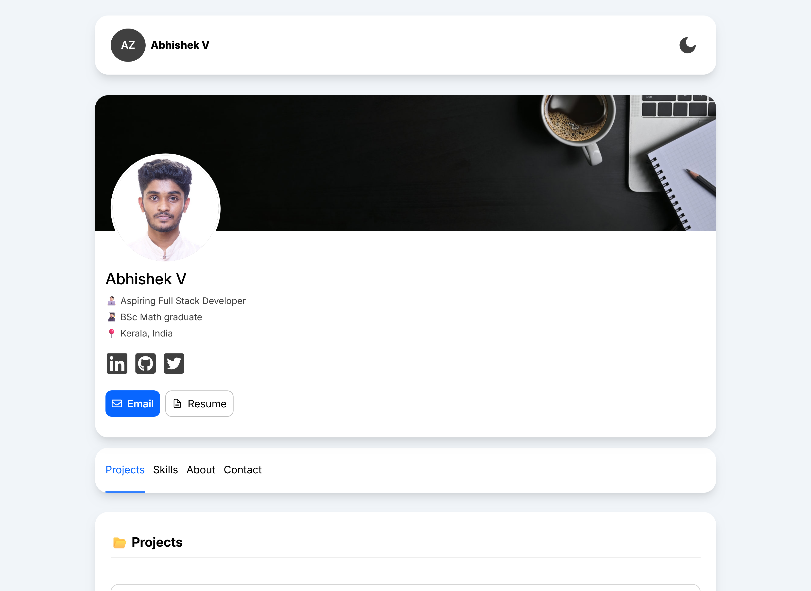

# 💼 Portfolio

## 📝 Project Description

Portfolio (v2) is a modern, responsive developer portfolio built with React and Vite. It showcases my latest projects, skills, and contact information in a clean, accessible, and visually appealing layout. The site features dark mode, dynamic project cards, and a modular component structure for easy maintenance and scalability.

## 🛠️ Built Using

## 📚 What I've Learned

- Building scalable React projects with Vite for fast development and builds.
- Creating modular, reusable components for maintainable code.
- Implementing dark mode and theme toggling with CSS variables.
- Managing project data and assets efficiently.
- Responsive design techniques for optimal viewing on all devices.
- Integrating Shields.io badges for a professional README.

## ⚠️ Challenges Faced

- Ensuring consistent styling and theming across light and dark modes.
- Handling image optimization and responsive layouts for project showcases.
- Managing complex project data and dynamic rendering of tech stacks.
- Keeping the UI accessible and user-friendly.
- Deploying to GitHub Pages and handling asset paths correctly.

## 📬 Contact Me

